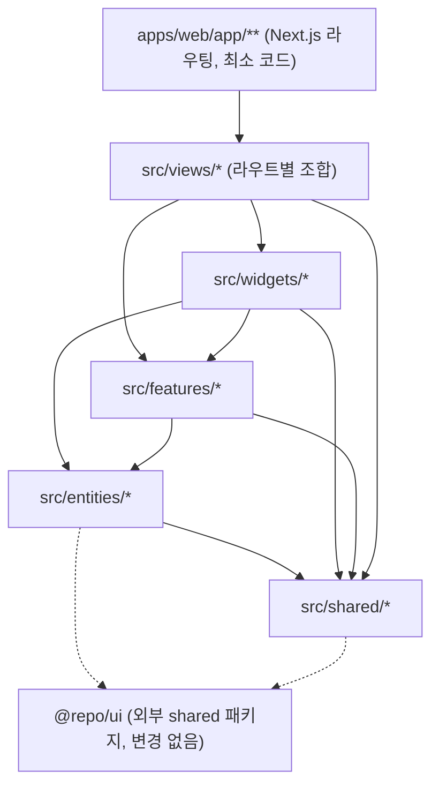

# FSD 아키텍처 전환 설계 문서

`apps/web`(콘솔 앱)을 Feature-Sliced Design(FSD)으로 전환하기 위한 설계 문서입니다. 이 문서는 **설계·매핑만** 다루며, 실제 코드 이동은 후속 작업으로 별도 진행합니다.

## 0. 범위

- 대상: `apps/web` (콘솔 앱)만.
- 비대상: `apps/docs`, `apps/storybook`, `packages/*`. 단 `packages/ui`(`@repo/ui`)는 FSD 레이어 밖의 외부 공유 디자인 시스템으로 계속 참조됩니다.
- 이번 문서 작성 단계에서는 코드를 옮기지 않습니다. 실제 이동은 [7. 단계별 마이그레이션 로드맵](#7-단계별-마이그레이션-로드맵)을 따라 별도 PR들로 진행합니다.

## 1. 배경 및 목표

현재 `apps/web`은 라우팅(`app/`), 프레젠테이션(`components/`), 도메인 로직(`lib/`)이 각각 하나의 평면 디렉터리에 모여 있습니다. 도메인(워크플로, 실행, 통합, 감사, 멤버, 알림 등)이 늘어나면서:

- `components/`와 `lib/`에 서로 다른 도메인의 파일이 뒤섞여 어떤 코드가 어떤 기능에 속하는지 파악하기 어렵습니다.
- 도메인 간 의존 방향이 강제되지 않아 순환 참조·암묵적 결합이 생기기 쉽습니다.
- 새 도메인 추가 시 어디에 파일을 둘지 규칙이 없습니다.

FSD는 레이어(상하 의존 방향)와 슬라이스(도메인 단위)로 이 문제를 해결합니다. `apps/web`부터 우선 적용하고, 검증되면 다른 앱에도 확장을 검토합니다.

## 2. FSD 레이어 개념과 Next.js App Router 어댑테이션

Next.js는 라우팅을 위해 물리적으로 `app/` 디렉터리를 요구하므로 FSD의 `app` 레이어 이름과 충돌합니다. 이를 다음과 같이 절충합니다.

- `apps/web/app/**`은 **라우팅 전용 얇은 계층**으로 유지합니다. `page.tsx` / `layout.tsx` / `route.ts` / `loading.tsx` / `error.tsx`만 남기고, 실제 화면 조합·로직은 `apps/web/src/`에서 import해서 렌더링만 합니다.
- 실제 FSD 소스는 `apps/web/src/`에 새로 두고 레이어를 구성합니다: `app`(전역 프로바이더/전역 스타일), `views`, `widgets`, `features`, `entities`, `shared`.
- FSD의 `pages` 레이어는 Next.js `app/`과 이름이 겹쳐 혼동되므로 이 문서에서는 **`views`**로 명명합니다(역할은 FSD `pages`와 동일: 라우트별 최상위 화면 조합).
- `processes` 레이어는 최신 FSD 가이드에서도 사용을 지양(deprecated)하므로 도입하지 않습니다.



레이어 의존 규칙: 상위 레이어는 하위 레이어만 참조할 수 있습니다(`views → widgets/features/entities/shared`, `widgets → features/entities/shared`, `features → entities/shared`, `entities → shared`). 같은 레이어 내 슬라이스 간 직접 참조는 금지하고, 필요하면 상위 레이어에서 조합합니다.

## 3. 목표 디렉터리 트리

```text
apps/web/
  app/                          # Next.js 라우팅 전용 (얇은 wrapper)
    console/**/page.tsx         # → src/views/console-*를 import해서 렌더링
    login/page.tsx              # → src/views/login
    api/**/route.ts             # 라우팅 제약상 이동 불가, 서버 로직은 shared/entities import
  src/
    app/                        # 전역 프로바이더, 전역 스타일 엔트리
    views/                      # 구 "pages" 레이어 (라우트별 최상위 조합)
    widgets/                    # 레이아웃/조합 블록
    features/                   # 사용자 행동 단위
    entities/                   # 도메인 데이터 모델 + 기본 UI/훅
    shared/                     # 범용 유틸/설정/인프라 (도메인 지식 없음)
```

## 4. 슬라이스 매핑 (현재 파일 → 신규 레이어)

### entities (도메인 데이터 모델 + 기본 UI/훅)

- `entities/run`: [apps/web/lib/runs-mock.ts](apps/web/lib/runs-mock.ts), [apps/web/lib/run-server-store.ts](apps/web/lib/run-server-store.ts), [apps/web/app/console/runs/runs-table.tsx](apps/web/app/console/runs/runs-table.tsx), [apps/web/app/console/runs/run-workflow-graph.tsx](apps/web/app/console/runs/run-workflow-graph.tsx)
- `entities/workflow`: [apps/web/lib/workflow/](apps/web/lib/workflow) (`types.ts`, `seeds.ts`, `storage.ts`, `xyflow.ts`, `execute-workflow.ts`, `derive-trigger-label.ts`, `merge-workflows.ts`, `remote-storage.ts`), [apps/web/lib/workflow-runtime/](apps/web/lib/workflow-runtime) (`context.ts`, `execute.ts`, `topological.ts`, `node-handlers.ts`, `webhook-registry.ts`), [apps/web/lib/workflows-mock.ts](apps/web/lib/workflows-mock.ts), [apps/web/lib/workflow-server-store.ts](apps/web/lib/workflow-server-store.ts), [apps/web/app/console/workflows/workflows-table.tsx](apps/web/app/console/workflows/workflows-table.tsx)
- `entities/integration`: [apps/web/lib/integrations-mock.ts](apps/web/lib/integrations-mock.ts)
- `entities/member`: [apps/web/lib/members-mock.ts](apps/web/lib/members-mock.ts), [apps/web/components/members-table.tsx](apps/web/components/members-table.tsx)
- `entities/audit-event`: [apps/web/lib/audit-mock.ts](apps/web/lib/audit-mock.ts), [apps/web/app/console/audit/audit-events.tsx](apps/web/app/console/audit/audit-events.tsx)
- `entities/notification`: [apps/web/lib/notifications-mock.ts](apps/web/lib/notifications-mock.ts), [apps/web/lib/notifications.types.ts](apps/web/lib/notifications.types.ts), [apps/web/lib/notifications-read-store.ts](apps/web/lib/notifications-read-store.ts)
- `entities/session`: [apps/web/lib/session.ts](apps/web/lib/session.ts), [apps/web/lib/session-constants.ts](apps/web/lib/session-constants.ts), [apps/web/lib/rbac.ts](apps/web/lib/rbac.ts)
- `entities/usage`: [apps/web/lib/usage-mock.ts](apps/web/lib/usage-mock.ts), [apps/web/lib/usage-format.ts](apps/web/lib/usage-format.ts)

### features (사용자 행동 단위)

- `features/workflow-editor`: [apps/web/app/console/workflows/use-workflow-editor.ts](apps/web/app/console/workflows/use-workflow-editor.ts), `workflow-editor-client.tsx`, `workflow-node-inspector.tsx`, `new-workflow-redirect.tsx`
- `features/runs-filter`: `runs-filters.tsx` (+ [apps/web/lib/search-params.ts](apps/web/lib/search-params.ts) 활용)
- `features/integrations-filter`: `integrations-filters.tsx`
- `features/audit-filter`: `audit-filters.tsx`, `audit-events-client.tsx`, [apps/web/lib/audit-actions.ts](apps/web/lib/audit-actions.ts)
- `features/notifications-bell`: [apps/web/components/notifications-bell.tsx](apps/web/components/notifications-bell.tsx), `notifications-bell-data.tsx`, [apps/web/app/console/notifications/notifications-list.tsx](apps/web/app/console/notifications/notifications-list.tsx)
- `features/auth`: [apps/web/app/login/login-form.tsx](apps/web/app/login/login-form.tsx), [apps/web/app/actions/auth.ts](apps/web/app/actions/auth.ts), [apps/web/lib/proxy-auth.ts](apps/web/lib/proxy-auth.ts), [apps/web/lib/redirect-path.ts](apps/web/lib/redirect-path.ts)
- `features/permission-gate`: [apps/web/components/permission-gate.tsx](apps/web/components/permission-gate.tsx)
- `features/theme-toggle`: [apps/web/components/theme-toggle.tsx](apps/web/components/theme-toggle.tsx)
- `features/command-palette`: [apps/web/components/console-command-palette.tsx](apps/web/components/console-command-palette.tsx), `console-command-palette-utils.ts`, `shortcuts-help-dialog.tsx`
- `features/api-dev-simulation`: `api-dev-simulation-panel.tsx`, `api-dev-simulation-panel-data.tsx`, [apps/web/lib/api-dev-simulation.ts](apps/web/lib/api-dev-simulation.ts), `api-dev-simulation-server.ts`, [apps/web/app/actions/api-dev-simulation.ts](apps/web/app/actions/api-dev-simulation.ts)
- `features/onboarding-checklist`: [apps/web/components/onboarding-checklist.tsx](apps/web/components/onboarding-checklist.tsx)

### widgets (레이아웃/조합 블록)

- `widgets/app-sidebar`: [apps/web/components/app-sidebar.tsx](apps/web/components/app-sidebar.tsx), `console-nav-items.ts`
- `widgets/app-header`: `app-product-header.tsx`, `header.tsx`, `footer.tsx`
- `widgets/api-status-banner`: `api-status-banner.tsx`, `console-api-banner.tsx`
- `widgets/dashboard-overview`: `dashboard-overview.tsx`

### views (라우트별 최상위 조합 — `apps/web/app/**/page.tsx`가 여기를 얇게 호출)

- `views/console-overview`, `views/console-workflows`, `views/console-workflow-editor`, `views/console-runs`, `views/console-run-detail`, `views/console-integrations`, `views/console-audit`, `views/console-members`, `views/console-notifications`, `views/console-settings`, `views/console-billing`, `views/login`, `views/marketing-home`

### shared (범용 유틸/설정/인프라, 도메인 지식 없음)

- `shared/api`: [apps/web/lib/console-api.ts](apps/web/lib/console-api.ts), `console-data.ts`, `console-degradation.ts`, `mock-api.ts`, `resource-store.ts`
- `shared/config`: [apps/web/lib/config.ts](apps/web/lib/config.ts)
- `shared/lib`: `datetime.ts`, `search-params.ts`, `use-url-search-navigate.ts`
- `shared/ui`: `@repo/ui` re-export wrapper (필요 시)

## 5. Import 규칙

- 레이어는 위(`views`)에서 아래(`shared`) 방향으로만 참조합니다. 역방향 참조는 금지합니다.
- 동일 레이어 내 슬라이스 간 직접 참조는 금지합니다(예: `features/audit-filter`가 `features/runs-filter`를 직접 import하지 않음). 필요하면 상위 레이어(`widgets`/`views`)에서 조합합니다.
- 각 슬라이스는 `index.ts`(public API)를 통해서만 외부에 노출합니다. 슬라이스 내부 파일을 깊은 경로로 직접 import하지 않습니다.
- `shared`는 도메인 지식을 포함하지 않습니다. 특정 도메인 이름(`run`, `workflow` 등)이 `shared` 코드에 등장하면 잘못된 위치입니다.

## 6. Path Alias 제안

현재 `apps/web`은 전부 상대 경로(`../../lib/...`, `../../../components/...`)를 사용합니다. 레이어가 깊어지면 상대 경로가 급격히 길어지므로 `apps/web/tsconfig.json`에 다음 alias 추가를 제안합니다.

```jsonc
{
  "compilerOptions": {
    "baseUrl": ".",
    "paths": {
      "@/app/*": ["./src/app/*"],
      "@/views/*": ["./src/views/*"],
      "@/widgets/*": ["./src/widgets/*"],
      "@/features/*": ["./src/features/*"],
      "@/entities/*": ["./src/entities/*"],
      "@/shared/*": ["./src/shared/*"]
    }
  }
}
```

## 7. 단계별 마이그레이션 로드맵 (실행은 후속 작업)

1. **Phase 0**: `apps/web/src/` 스캐폴딩 + 위 path alias 추가. 기존 코드는 그대로 두고 빌드/타입체크만 통과시킴.
2. **Phase 1 (`shared`)**: 의존성이 가장 적은 `console-api.ts`, `config.ts`, `datetime.ts`, `search-params.ts` 등을 `src/shared`로 이동. import 경로만 갱신.
3. **Phase 2 (`entities`)**: 도메인별 mock/store/타입을 `src/entities/<domain>`으로 이동.
4. **Phase 3 (`features`/`widgets`)**: 필터, 커맨드 팔레트, 워크플로 에디터 등 행동 단위와 레이아웃 블록 이동.
5. **Phase 4 (`views`)**: 라우트별 조합을 `src/views/<route>`로 옮기고, `apps/web/app/**/page.tsx`는 해당 `views`를 import해서 렌더링만 하는 얇은 wrapper로 축소.
6. **Phase 5 (자동화)**: `eslint-plugin-boundaries` 또는 Steiger 같은 FSD 린터를 도입해 레이어 위반 import를 CI에서 자동 검출.

각 phase는 별도 PR로 나누고, phase마다 `pnpm lint` / `pnpm check-types` / `pnpm test`를 통과시킨 뒤 다음 phase로 진행합니다.

## 8. 리스크 및 미결 사항

- **테스트 파일 위치**: 현재 `*.test.ts`가 대상 파일과 같은 디렉터리에 있습니다(`apps/web/lib/*.test.ts`). FSD 이동 시에도 슬라이스 내부에 동일하게 콜로케이션할지, 별도 `__tests__/`로 모을지 결정 필요.
- **Route Handler 제약**: `apps/web/app/api/mock/**/route.ts`는 Next.js 라우팅 규칙상 물리적 위치를 옮길 수 없습니다. 핸들러 본문은 `shared/api` 또는 관련 `entities`의 서버 로직을 import하는 얇은 형태로 유지합니다.
- **`packages/ui` 범위 제외**: 이번 전환은 `apps/web` 내부 구조만 다룹니다. `@repo/ui`는 계속 외부 shared 패키지로 참조되며, 자체 FSD화 여부는 별도 논의가 필요합니다.
- **`app/console/layout.tsx` 등 레이아웃 파일**: Next.js 요구사항상 `app/` 내부에 남아야 하므로, 내부 로직만 `src/widgets`/`src/app`으로 위임하는 형태를 유지합니다.
