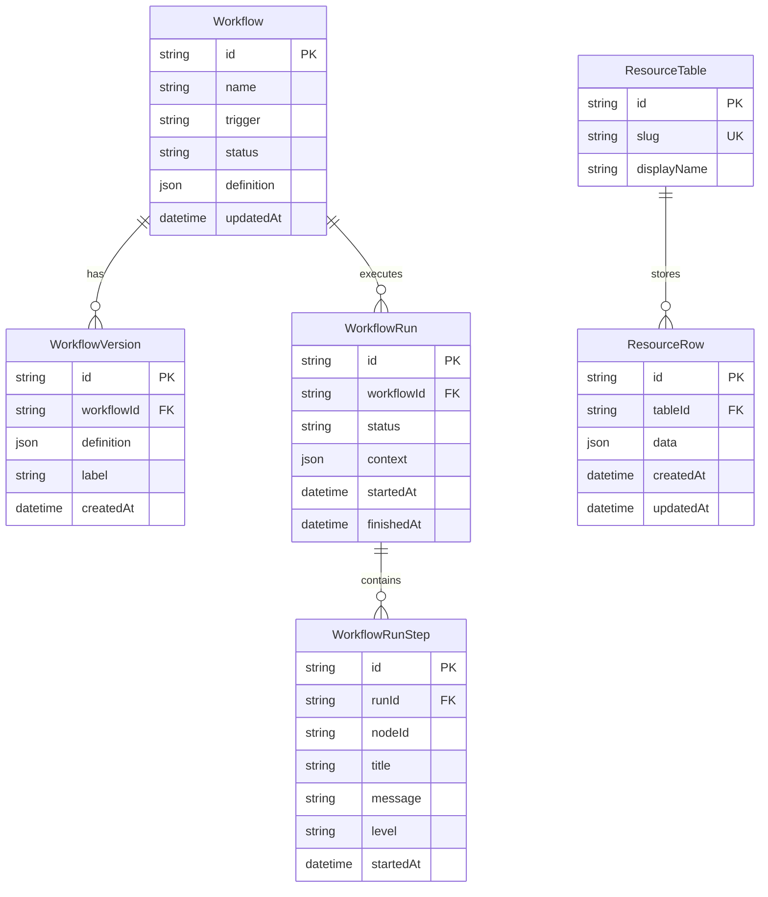
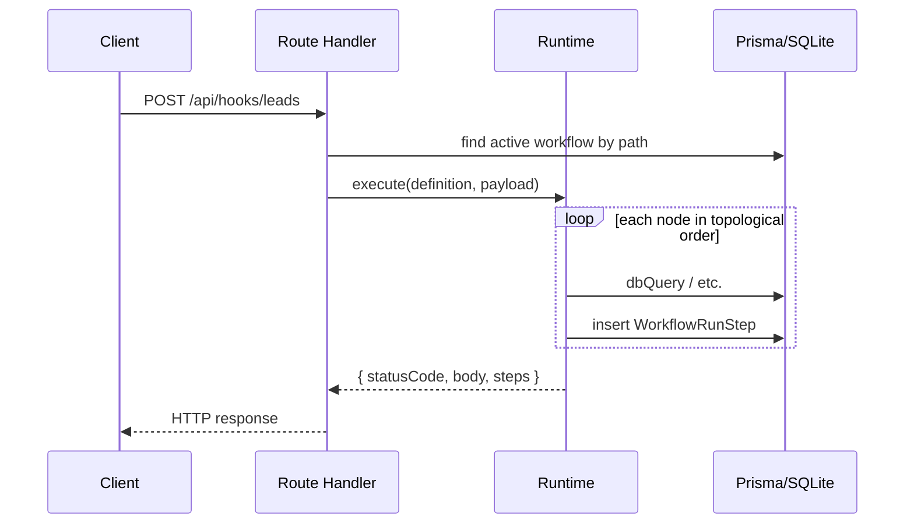

# 워크플로 런타임 · 경량 백엔드 설계 (안 B)

> **상태**: 설계 초안  
> **작성 기준**: `saas-interface-kit` 현재 구조 (2026-06)  
> **관련 문서**: [design.md](design.md), [plan.md](plan.md), [README.md](README.md)

---

## 1. 목적

n8n 스타일 `WorkflowEditor`로 정의한 그래프를 **서버에 영속화**하고, **실제 DB CRUD + HTTP 응답**까지 실행하는 **경량 워크플로 런타임**을 이 모노레포에 추가한다.

### 1.1 목표 (In scope)

| # | 목표 |
|---|------|
| G1 | 워크플로 정의·메타데이터를 **SQLite + Prisma**에 저장 |
| G2 | 콘솔 편집기가 **localStorage 대신 REST API**로 저장/로드 |
| G3 | `execute-workflow`를 **서버 실행기**로 대체하고 Run·Step 로그를 DB에 기록 |
| G4 | `status: active` 워크플로의 **Webhook 트리거**를 동적 HTTP 엔드포인트로 노출 |
| G5 | `dbQuery` 노드로 **허용된 테이블**에 대한 실 CRUD 수행 |
| G6 | 기존 `@repo/api-client`·mock API 패턴과 **호환** (`NEXT_PUBLIC_API_URL` 경로 유지) |

### 1.2 비목표 (Out of scope — 1차)

| # | 제외 |
|---|------|
| N1 | n8n·Temporal 등 **외부 워크플로 엔진** 연동 |
| N2 | 멀티 테넌트·수평 확장·큐 워커 클러스터 |
| N3 | 사용자 정의 SQL·임의 스키마 DDL (노코드로 테이블 생성) |
| N4 | Slack·이메일 노드의 **실제 외부 발송** (2차 이후) |
| N5 | 프로덕션급 인증 교체 (데모 세션·RBAC UI는 유지, API 키는 2차) |

---

## 2. 현재 상태 (As-Is)

```
┌─────────────────────────────────────────────────────────────┐
│  WorkflowEditorClient (browser)                             │
│    useWorkflowEditor → storage.ts → localStorage            │
│    runTest → execute-workflow.ts (in-memory simulation)     │
└─────────────────────────────────────────────────────────────┘
                              │
                              ▼ (목록만, 정의는 미연동)
┌─────────────────────────────────────────────────────────────┐
│  GET /api/mock/v1/workflows → MOCK_WORKFLOWS (fixture)      │
│  @repo/api-client — WorkflowSchema (메타만, definition 없음)│
└─────────────────────────────────────────────────────────────┘
```

### 2.1 기존 자산

| 자산 | 경로 | 재사용 |
|------|------|--------|
| 노드 타입·Zod 스키마 | `apps/web/lib/workflow/types.ts` | 그대로 (서버·클라 공유 후보) |
| 토폴로지 정렬 | `apps/web/lib/workflow/execute-workflow.ts` | `topologicalOrder` 재사용 |
| 편집 UI | `packages/ui/workflow-editor/` | 변경 최소 |
| API 클라이언트 | `packages/api-client` | 엔드포인트·스키마 확장 |
| Mock 시뮬레이션 | `apps/web/lib/mock-api.ts` | dev 전용 유지 |

### 2.2 갭

- 워크플로 **definition JSON** API 없음
- Run 생성·조회 API가 mock fixture에만 의존 (`runs` 목록은 api-client 미연동)
- DB·ORM 없음
- Webhook → 워크플로 매핑 없음

---

## 3. 목표 아키텍처 (To-Be)

```
┌──────────────┐     REST /v1/*      ┌──────────────────────────────┐
│  Console UI  │ ──────────────────► │  apps/web (Next.js)          │
│  WorkflowEd. │                     │  ├─ Route Handlers (API)     │
└──────────────┘                     │  ├─ lib/workflow-runtime/    │
                                     │  └─ lib/db/ (Prisma)         │
┌──────────────┐  POST /hooks/...    └──────────────┬───────────────┘
│  HTTP Client │ ─────────────────────────────────►│
└──────────────┘                                     ▼
                                          ┌─────────────────┐
                                          │  SQLite (file)   │
                                          │  workflows       │
                                          │  workflow_runs   │
                                          │  resources (*)   │
                                          └─────────────────┘
```

### 3.1 패키지 배치 (권장)

| 위치 | 역할 |
|------|------|
| `packages/workflow-schema` (신규, 선택) | `WorkflowDefinitionSchema` 등 **서버·클라 공유** Zod 타입 |
| `apps/web/prisma/` | 스키마·마이그레이션·seed |
| `apps/web/lib/db/` | Prisma client 싱글톤 |
| `apps/web/lib/workflow-runtime/` | 실행기, 노드 핸들러, webhook 라우팅 |
| `apps/web/app/api/v1/` | **실 API** (mock과 병행 후 점진 전환) |
| `packages/api-client` | 신규 메서드·스키마 추가 |

> **결정**: 1차는 `apps/web` 단일 앱에 Prisma를 두고, 타입 공유가 필요해지면 `packages/workflow-schema`로 추출한다. 별도 마이크로서비스는 만들지 않는다.

### 3.2 기술 스택

| 항목 | 선택 | 이유 |
|------|------|------|
| DB | **SQLite** (파일) | Docker 없이 로컬·CI 가능, 단일 앱 데모에 적합 |
| ORM | **Prisma** | Zod와 궁합, 마이그레이션·타입 생성 |
| API | Next.js Route Handlers | 기존 `/api/mock` 패턴 확장 |
| 검증 | Zod 4 | 프로젝트 기존 스택 |
| 실행 | 동기 in-process (1차) | 워커·Redis 없이 구현 가능 |

환경 변수 (추가):

```env
# apps/web/.env
DATABASE_URL="file:./dev.db"
WORKFLOW_RUNTIME_ENABLED=true
```

---

## 4. 데이터 모델

### 4.1 ER 개요



### 4.2 Prisma 스키마 (초안)

```prisma
// apps/web/prisma/schema.prisma

model Workflow {
  id          String   @id
  name        String
  trigger     String
  status      String   // draft | active | paused
  definition  Json
  createdAt   DateTime @default(now())
  updatedAt   DateTime @updatedAt
  versions    WorkflowVersion[]
  runs        WorkflowRun[]
}

model WorkflowVersion {
  id           String   @id @default(cuid())
  workflowId   String
  workflow     Workflow @relation(fields: [workflowId], references: [id], onDelete: Cascade)
  definition   Json
  versionLabel String?
  createdAt    DateTime @default(now())
}

model WorkflowRun {
  id          String   @id
  workflowId  String
  workflow    Workflow @relation(fields: [workflowId], references: [id], onDelete: Cascade)
  status      String   // queued | running | succeeded | failed | cancelled
  context     Json     @default("{}")
  startedAt   DateTime @default(now())
  finishedAt  DateTime?
  steps       WorkflowRunStep[]
}

model WorkflowRunStep {
  id        String   @id
  runId     String
  run       WorkflowRun @relation(fields: [runId], references: [id], onDelete: Cascade)
  nodeId    String
  title     String
  message   String
  level     String   // info | warning | error
  startedAt DateTime
}

/// 노코드 CRUD 대상 — 사전 등록된 리소스 테이블
model ResourceTable {
  id          String        @id @default(cuid())
  slug        String        @unique  // e.g. "contacts"
  displayName String
  rows        ResourceRow[]
}

model ResourceRow {
  id        String        @id @default(cuid())
  tableId   String
  table     ResourceTable @relation(fields: [tableId], references: [id], onDelete: Cascade)
  data      Json
  createdAt DateTime      @default(now())
  updatedAt DateTime      @updatedAt
}
```

### 4.3 CRUD 리소스 모델 설명

1차에서는 **사용자가 UI로 테이블을 만드는 것(N3)** 은 제외한다.  
대신 seed로 `contacts`, `leads` 등 **허용 slug**를 등록하고, `dbQuery` 노드는 `table` 필드가 `ResourceTable.slug` 화이트리스트에 있을 때만 동작한다.

`queryPreset` 매핑 (기존 `DbQueryNodeConfigSchema` 확장):

| preset | 동작 | HTTP 메서드 (webhook 조합 시) |
|--------|------|-------------------------------|
| `list_recent` | 최근 N건 조회 | GET |
| `by_id` | `context.payload.id`로 1건 | GET |
| `count` | 건수 | GET |
| `create` | `context.payload` insert | POST |
| `update` | id + payload patch | PUT/PATCH |
| `delete` | id로 삭제 | DELETE |

---

## 5. API 설계

기존 mock 경로(`/api/mock/v1/*`)는 dev·폴백용으로 유지하고, **실 API**는 `/api/v1/*` 또는 mock을 Prisma 구현으로 **교체**한다.

권장: **`/api/mock/v1` 핸들러 내부를 Prisma로 전환** → `NEXT_PUBLIC_API_URL` 변경 없이 동작.

### 5.1 워크플로

| Method | Path | 설명 |
|--------|------|------|
| GET | `/v1/workflows` | 목록 (`WorkflowSchema[]`) |
| POST | `/v1/workflows` | 생성 `{ name }` → `{ id, definition }` |
| GET | `/v1/workflows/:id` | 메타 + definition |
| PUT | `/v1/workflows/:id` | 메타 패치 `{ name?, status? }` |
| PUT | `/v1/workflows/:id/definition` | definition 저장 (Zod 검증) |
| POST | `/v1/workflows/:id/publish` | `status: active` + webhook 경로 등록 |
| POST | `/v1/workflows/:id/runs` | 수동/테스트 실행 |
| GET | `/v1/workflows/:id/versions` | 버전 이력 (선택) |

### 5.2 실행(Run)

| Method | Path | 설명 |
|--------|------|------|
| GET | `/v1/runs` | 목록 (필터: `workflowId`, `status`) |
| GET | `/v1/runs/:runId` | 상세 + steps (`RunSchema`) |

`RunSchema`·`WorkflowSchema`는 `packages/api-client/src/schemas.ts`와 **정합 유지**.

### 5.3 동적 Webhook (CRUD API 노출)

활성 워크플로의 trigger가 `webhook`이고 `path`가 `/hooks/leads`이면:

```
POST|GET|PUT|PATCH|DELETE  /api/hooks/{workflowId}/...
또는
POST|GET|...               /api/hooks{path}   // path = trigger.path
```

**1차 권장**: `/api/hooks/[...path]/route.ts` 단일 catch-all

1. `path`로 활성 워크플로 조회 (`trigger` 문자열 또는 definition 내 trigger 노드)
2. 요청 body·query를 `context.payload`에 주입
3. `executeWorkflowOnServer(definition, context)` 실행
4. 마지막 `httpResponse` 노드 결과를 실제 HTTP 응답으로 반환

예시 — Lead 생성 API:

```
Webhook POST /api/hooks/leads
  → trigger
  → dbQuery (create, table: leads)
  → httpResponse (201, bodyTemplate)
```

### 5.4 리소스 CRUD (직접 REST, 선택)

워크플로 없이 리소스만 다루는 관리용 API (콘솔·디버그):

| Method | Path |
|--------|------|
| GET | `/v1/resources/:slug` |
| POST | `/v1/resources/:slug` |
| GET | `/v1/resources/:slug/:id` |
| PATCH | `/v1/resources/:slug/:id` |
| DELETE | `/v1/resources/:slug/:id` |

---

## 6. 워크플로 런타임

### 6.1 모듈 구조

```
apps/web/lib/workflow-runtime/
  index.ts
  execute.ts          # executeWorkflowOnServer
  topological.ts      # execute-workflow.ts에서 분리
  node-handlers/
    trigger.ts
    db-query.ts       # Prisma ResourceRow CRUD
    transform.ts      # JSON path / 간단 map (1차: pass-through + template)
    http-response.ts  # 응답 조립
    slack-notify.ts   # stub → warning 로그
    email-send.ts     # stub
  webhook-registry.ts # active workflow path → id
  context.ts          # ExecutionContext 타입
```

### 6.2 실행 흐름



### 6.3 노드 핸들러 계약

```ts
type NodeHandler = (
  node: WorkflowNode,
  ctx: ExecutionContext,
) => Promise<{
  message: string;
  level: "info" | "warning" | "error";
  patch?: Partial<ExecutionContext>;
  httpResponse?: { statusCode: number; body: unknown };
}>;
```

- `httpResponse` 노드는 **터미널** — 실행 종료 후 응답 확정
- `httpResponse` 없이 끝나면 `200 { "ok": true }` 기본
- 에러 시 Run `status: failed`, 이후 노드 스킵

### 6.4 `dbQuery` 구현 요약

```ts
// pseudo
const table = await prisma.resourceTable.findUnique({ where: { slug: config.table } });
if (!table) throw new Error("Unknown table");

switch (config.queryPreset) {
  case "create":
    const row = await prisma.resourceRow.create({
      data: { tableId: table.id, data: ctx.payload },
    });
    ctx.lastRow = row;
    break;
  // list_recent, by_id, count, update, delete ...
}
```

---

## 7. 프론트엔드 변경

### 7.1 `useWorkflowEditor` 전환

| 현재 | 변경 후 |
|------|---------|
| `loadDefinition` / `saveDefinition` (localStorage) | `api-client` `getWorkflow`, `putWorkflowDefinition` |
| `createWorkflow` (local) | `POST /v1/workflows` |
| `runTest` → `executeWorkflow` (client) | `POST /v1/workflows/:id/runs` |

localStorage는 **오프라인 폴백**으로 1~2주 병행 후 제거.

### 7.2 api-client 확장

`packages/api-client/src/client.ts` 추가 메서드:

```ts
getWorkflow(id: string): Promise<WorkflowDetail>;
createWorkflow(body: { name: string }): Promise<WorkflowDetail>;
updateWorkflow(id: string, body: Partial<Workflow>): Promise<Workflow>;
putWorkflowDefinition(id: string, definition: WorkflowDefinition): Promise<void>;
publishWorkflow(id: string): Promise<Workflow>;
createWorkflowRun(id: string, body?: { payload?: unknown }): Promise<Run>;
```

`WorkflowDetail = Workflow & { definition: WorkflowDefinition }` — Zod 스키마 신규.

### 7.3 UI 변경 (최소)

- `WorkflowEditorClient`: 저장/테스트 실행 시 API 호출 + toast
- `dbQuery` 인스펙터: `queryPreset`에 `create`/`update`/`delete` 옵션 추가
- `/console/runs`: api-client `getRuns` 연동 (mock 폴백 유지)

---

## 8. 보안 · 권한

| 계층 | 1차 | 2차 |
|------|-----|-----|
| 콘솔 API | 기존 데모 세션 + `workflows:manage` RBAC | 동일 |
| Webhook | **공개 URL** (데모) — `active`만 노출 | API 키·HMAC 서명 |
| dbQuery | ResourceTable slug 화이트리스트 | 행 수준 orgId 스코프 |
| SQL | **Raw SQL 금지** — Prisma JSON 필드만 | — |

Webhook 남용 방지 (1차):

- `draft`/`paused` 워크플로는 라우트 미등록
- 요청 body 크기 제한 (예: 256KB)
- 실행 시간 상한 (예: 10s)

---

## 9. 마이그레이션

### 9.1 localStorage → DB

1. `pnpm prisma db seed`로 `SEED_REGISTRY` / `SEED_DEFINITIONS` 반영
2. 클라이언트 첫 로드 시 `localStorage`에 데이터 있으면 `POST /v1/workflows/migrate` (1회, 선택)
3. 마이그레이션 완료 플래그 `workflow:migrated` 설정

### 9.2 mock fixture

`apps/web/lib/workflows-mock.ts`는 **api-client 폴백**용으로 유지.  
Prisma 연결 실패 시 `withMockFallback` 패턴 재사용.

---

## 10. 구현 단계

### Phase 1 — 기반 (3~5일)

- [ ] Prisma + SQLite 설정, schema, seed (`contacts`, `leads`)
- [ ] `lib/db/prisma.ts` 싱글톤
- [ ] `GET/POST /v1/workflows`, `GET/PUT .../definition`
- [ ] api-client·스키마 확장
- [ ] Vitest: repository + route handler 테스트

### Phase 2 — 편집기 연동 (2~3일)

- [ ] `useWorkflowEditor` API 전환
- [ ] 저장·로딩 UI 피드백 (toast, error)
- [ ] localStorage 마이그레이션 (선택)

### Phase 3 — 서버 실행기 (4~5일)

- [ ] `workflow-runtime/execute.ts` + node handlers
- [ ] `POST /v1/workflows/:id/runs`
- [ ] `GET /v1/runs`, `GET /v1/runs/:id` Prisma 연동
- [ ] `/console/runs` api 연동

### Phase 4 — Webhook CRUD API (3~4일)

- [ ] `/api/hooks/[...path]/route.ts`
- [ ] `publish` 시 path 충돌 검사
- [ ] `dbQuery` create/update/delete preset
- [ ] E2E: POST /api/hooks/leads → DB row + HTTP 201

### Phase 5 — 문서·품질 (1~2일)

- [ ] README, AGENTS.md, design.md 갱신
- [ ] docs 앱에 “워크플로 런타임” 페이지
- [ ] `pnpm lint` / `check-types` / `test` CI 통과

**총 추정**: 2~3주 (1인, 기존 코드베이스 숙지 기준)

---

## 11. 테스트 전략

| 레벨 | 대상 |
|------|------|
| 단위 | `topologicalOrder`, 각 node handler, Zod schema |
| 통합 | Route Handler + Prisma (in-memory SQLite 또는 test db file) |
| 계약 | api-client ↔ Route Handler 응답 (기존 `client.test.ts` 패턴) |
| E2E (선택) | Playwright: 편집 → 저장 → webhook POST → runs 페이지 |

CI: `.github/workflows/ci.yml`에 `prisma migrate deploy` + `prisma db seed` 단계 추가.

---

## 12. 제한사항 · 향후 확장

### 12.1 1차 제한

- SQLite 단일 파일 → 동시 쓰기·다중 인스턴스에 부적합
- 실행기 in-process → 장시간·대량 배치 부적합
- `transform` 노드는 템플릿 치환 수준

### 12.2 2차 이후

| 항목 | 방향 |
|------|------|
| DB | Postgres + orgId 멀티테넌트 |
| 실행 | BullMQ / Inngest 워커 |
| 노드 | 실 Slack/Email, HTTP Request 노드 |
| 스키마 | UI에서 ResourceTable 정의 (진정한 노코드 CRUD) |
| n8n | export/import 또는 webhook 위임 |

---

## 13. 성공 기준 (Definition of Done)

1. 콘솔에서 워크플로 편집 → **새로고침 후에도** definition 유지 (DB)
2. **테스트 실행** 시 Run·Step이 `/console/runs/[id]`에 표시
3. `active` 워크플로 webhook으로 **POST** 시 `ResourceRow` 생성 + 설정한 HTTP status/body 반환
4. `NEXT_PUBLIC_API_URL=http://localhost:3001/api/mock` 설정 시 **기존 콘솔 플로우** 동작 (mock 경로 Prisma화)
5. 품질 게이트 통과

---

## 14. 참고 파일 (현재 코드)

| 파일 | 용도 |
|------|------|
| `apps/web/lib/workflow/types.ts` | 노드·definition 스키마 |
| `apps/web/lib/workflow/execute-workflow.ts` | 시뮬 실행 (교체 대상) |
| `apps/web/lib/workflow/storage.ts` | localStorage (폐기 대상) |
| `apps/web/lib/workflow/seeds.ts` | seed 데이터 원본 |
| `apps/web/app/api/mock/v1/workflows/route.ts` | API 교체 지점 |
| `packages/api-client/src/schemas.ts` | `WorkflowSchema`, `RunSchema` |
| `apps/web/app/console/workflows/use-workflow-editor.ts` | 편집기 훅 |

---

## 15. 오픈 이슈

| # | 질문 | 권장 |
|---|------|------|
| O1 | mock 경로를 Prisma로 **대체** vs `/api/v1` **분리**? | mock 대체 (URL 변경 없음) |
| O2 | `workflow-schema` 패키지 1차 분리 여부 | Phase 3 이후 필요 시 |
| O3 | Webhook URL: `/api/hooks/{id}` vs `/api/hooks{path}` | path 기반 (사용자 친화) |
| O4 | 데모 세션 orgId 스코프 | 1차 단일 org, schema에 `orgId` nullable 컬럼만 예약 |
